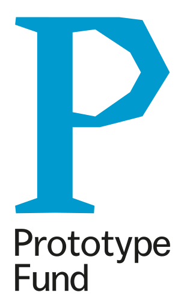

# HubGrep

Search for code repositories over many code-hosting services at once, without non-repo clutter.


## deployment

### Setup

create a config by copying `.env.dist` to `.env`, and add the missing values.

then start the service and database

    docker-compose up


and maybe you want to have a container to run cli commands:

    docker-compose run --rm service /bin/bash

in the container you have to run the db migrations

    # create migration files, 
    # only if you changed something in the models
    #flask db migrate  

    # upgrade your datbase
    flask db upgrade

create the admin user

    flask cli init


    # todo: 
    - a prod docker container, using external assets, not linking the sourcecode
    - nginx setup


### Usage

after that, add some hosters to search. use either the frontend, 
or the cli, to add, for example, github:

    flask cli add-hoster github "https://api.github.com/" "https://github.com/" "{}"
    flask cli add-hoster gitea "https://codeberg.org/api/v1/" "https://codeberg.org/" "{}"
    flask cli add-hoster gitea "https://gitea.com/api/v1/" "https://gitea.com/" "{}"


#### Adding Gitlab Instances

gitlab needs an api key ("token") to use the api.

> ! keep in mind, that with this token, your private repositories can be read as well
> so its recommended to create a new, empty user account for this !

to create a new token, log in to your gitlab account, 
find "access tokens" in your user settings, and create a new "personal access token" 
without an expiration date, and with the `read_api` scope.

after you created your key, you can add this instance as well:
    
    flask cli add-hoster gitlab "https://gitlab.com/api/v4/" "https://gitlab.com/" '{"api_token": "XXXXXXXXXXX"}'


substitute the base url with whatever gitlab instance you want to add, of course. :)


## Development Setup

### Web-fronend:

    docker-compose up

Navigate to `0.0.0.0:8080` in your browser to search.

### CLI:

```
docker-compose run --rm service /bin/bash
flask cli search <TERMS>
```

## Testing

Using pytest and pytest-coverage, run:

    ./manage.sh test
    

## Localization

Using Flask-Babel, we generate catalogues by first extracting strings from the application. Strings from templates and
from code which uses "gettext" (for example) will be extracted into a .pot file which we then fill in translation for.

First extract:

    pybabel extract -F babel.cfg -o messages.pot hubgrep

Then, after MANUALLY filling in translation texts in this file (empty "msgstr" fields), either update existing or init:

    pybabel init -l [YOUR_LANG] -i messages.pot -d hubgrep/translations
    - OR -
    pybabel update -i messages.pot -d hubgrep/translations
    
Finally, compile the translation for usage:

    pybabel compile -d hubgrep/translations -l [YOUR_LANG]
    
Strings should now be replaced by the appropriate locale variant when rendered.


## Production Setup


There is a separate dockerfile `Dockerfile.prod` for production builds, 
which is used in the `docker-compose.prod.yml` file.

To build an image with generated assets and source code baked in, 
run `docker-compose -f docker-compose.prod.yml build`.

You can use it the same way as the development compose file.

Configuration is almost the same as in development - 
just adjust your .env file, and change the docker-compose
file to your needs (for example, if you are running a separate postgres.)


To start the container, just run

```
docker-compose -f docker-compose.prod.yml up
``` 

(or add a `-d` to detach).

On first setup, you need to create the database structure and set up the admin user.
Easiest is, to run a new shell in the container:

```
docker-compose -f docker-compose.prod.yml run --rm service /bin/bash
```

and in there, run

```
flask db upgrade
flask cli init
```


You probably want to serve the assets via webserver, not with gunicorn.
To get the assets, you can run `flask cli copy-static`.  
This can be used to get the files out of a docker container - see `docker-compose.prod.yml`
for an example!


## Customize the About Page

Set environment variable `HUBGREP_ABOUT_MARKDOWN_FILE` to a path containing a markdown file,
and it will be rendered into the about page.


# Funded from March 2021 until August 2021 by

<p style="display: flex; flex-direction: row; justify-content: center; align-items: center;">
    <a href="https://www.bmbf.de/en/" rel="nofollow">
        
    </a>
    <a href="https://prototypefund.de/en/" rel="nofollow">
        
    </a>
</p>
